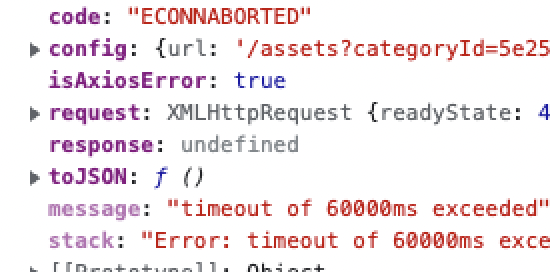
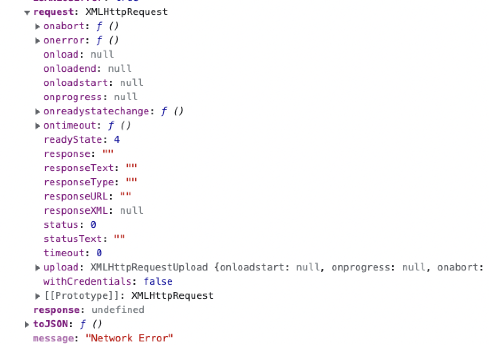

axios를 timeout을 주고 사용하고 있었다.
분명 axios에서 에러가 나면 `error.response` 값을 활용해서 에러처리를 하고 있었는데
빈 error message가 뜬다는 현상이 가끔 CS로 올라왔다.

한참을 못 찾다가 찾아낸 것이 axios의 timeout 됐을 때의 error였다.
axios의 config에서 timeout을 60000 으로 설정해두었는데 느린 환경에서 용량이 큰 파일을 업로드할 때 60초 이상이 걸려서 연결이 끊겨서 에러가 나는 것이었다. 글로벌 서비스였기에 느린 환경에서 큰 옹량의 파일을 올릴 때 에러가 나는 것 같았다.
해당 에러일 때는 axios의 error 객체에 response가 `undefined` 로 내려와서 기존과 같은 방법으로는 처리 하기가 힘들었고, error.code에 `ECONNABORTED` 값이 추가 되기 때문에 아래와 같이 처리하였다.



<br />

```ts
if (error.code === 'ECONNABORTED') {
    // timeout 관련 에러처리
}
```
timeout이 아닐 때의 code 값은 보통 `undefined` 로 내려왔다. (예외가 있을 수 있다.)


<br />

그리고 파일을 업로드 하는 도중에 client의 network가 offline으로 끊겼을 때도 error.response가 `undefined`로 내려오는 것을 확인할 수 있었다. (업로드 도중 개발자 도구의 network를 offline으로 바꾸었을 때)
해당 경우일 때는 `window.navigator.online` 값을 통해 구분하였다.
network가 offline일 경우 `window.navigator.online`가 false가 된다.
그래서 다음과 같이 처리하였다.



<br />


```ts
if (!error.response && !window.navigator.online) {
    // offline 처리
}

```
