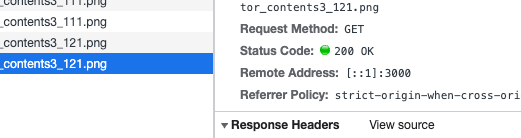

 기본적인 이미지가 있고, 해당 이미지에 마우스를 hover할 시에 이미지가 변경이 되었어야했다.
처음엔 그냥 hover시 css에서 background-url을 변경해주었다.
그러자 배포서버에서 이미지가 깜빡이는 경우가 발생하였다.
네트워크를 확인해보니, hover시에 status 200 Code로 이미지를 불러오는 것을 볼 수 있었다.
그래서 이미지를 불러오는 시간 때문에 깜빡거림이 발생한 것이다.
첫번째 hover 이후에는 캐싱이 되어서 깜빡거림이 없긴했지만, 처음 hover시가 심했다. 특히 느린 network에서는 엄청 심했다. 

<br/>




그래서 image preload를 사용해보기로 하였다.
useEffect 에서 hover할 시의 image를 미리 불러올 수 있게 작성하였다.

```ts
const [preloadImage, setPreloadImage] = useState<HTMLImageElement | null>(null);

useEffect(() => {
    if (hoverImgSrc) {
        const image = new Image();
        image.src = hoverImgSrc;
        setPreloadImage(image);
    }
}, [hoverImgSrc]);
```

이렇게 했을 시에 네트워크 탭을 살펴보니 304로 캐시된 이미지를 불러오는 것을 확인할 수 있었다.
하지만, 캐시된 것일지라도 다시 불러오는 것이기 때문에 기존보다 빨리 불러오긴 하지만 조금의 깜빡거림이 발생하는 것을 막을 수는 없었다.

<br/>


그래서 preload시에 만든 img 를 state에 저장해두고, 그 img의 src를 컴포넌트에서 사용하도록 수정하였다.
그랬더니 네트워크 탭을 확인했을 때 처음에 요청한거를 그대로 사용하여, hover시에 304로 캐시된 이미지를 불러오는 요청이 없어졌다.
처음 hover시에도 깜빡거리지 않고, 자연스러운 이미지 변경이 가능했다.

```ts
const [preloadImage, setPreloadImage] = useState<HTMLImageElement | null>(null);

useEffect(() => {
    if (hoverImgSrc) {
        const image = new Image();
        image.src = hoverImgSrc;
        setPreloadImage(image);
    }
}, [hoverImgSrc]);
```

확인시에 주의할 점은, 개발자 도구를 키고, disable cache를 해제해야, 유정입장에서 캐쉬가 잘 되는지를 확인할 수 있다. 그리고, 확인할 때마다 캐시 비우기 및 강력 새로고침을 해야 제대로 확인할 수 있을 것이다.