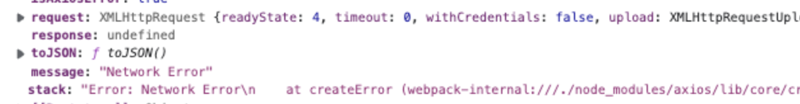
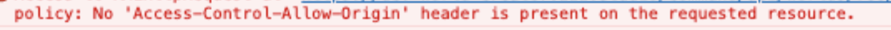

백엔드쪽 nginx에 파일 용량을 제한하는 설정을 추가하였다.
`client_max_body_size 200M` 이런식으로 추가를 한 것이다.

 

그러자 axios error의 response가 나오지 않기 시작하였다.
원래 제대로 error 정보가 내려오면 `error.response` 가 존재하고, `error.response.status` 로 status를 알 수 있는데
response 값이 비어있으니 에러처리를 하기가 애매했다.

 

 

`error.request && !error.response` 때를 기준으로 처리해볼까도 했지만 그러면 413이 아닌 Nginx 에러일 경우에도
해당 부분에서 에러처리가 되기 때문에 사용하기가 애매했다.

어떤게 문제였을까? 계속 문제를 찾아보다 보니 에러에 Cors 에러가 나오는게 보였다.
 

 

분명히 서버쪽에서는 cors 처리를 다 해놓았는데, 왜 이 에러가 나는걸까?
Nginx에서는 200~300 응답 말고, 400~500 인 에러는 cors 설정을 따로 해주지 않으면 cors 에러가 난다고 한다.
그래서 nginx에 `nginx.ingress.kubernetes.io/enable-cors: 'true'` 설정을 추가하였다.

 

그러자 error의 response가 잘 내려오는 것을 확인할 수 있었고, status에 따라 적절한 에러처리를 할 수 있었다.
